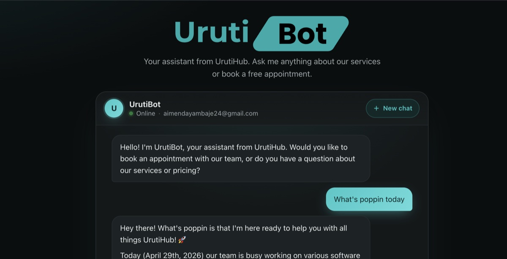

<div align="center">


# UrutiBot

**Your AI-powered assistant from UrutiHub - chat, ask, book.**

[](https://adoptium.net/)
[](https://spring.io/projects/spring-boot)
[](https://github.com/langchain4j/langchain4j)
[](https://www.anthropic.com)
[](https://www.mongodb.com/atlas)
[](#-docker)

<br />



</div>

---

## ✨ Overview

**UrutiBot** is a single-page chat experience and REST API that lets visitors of UrutiHub Ltd talk to a Claude-powered assistant, ask about services, and book free appointments - all with persistent conversation memory keyed by their email.

The chat is server-streamed (token-by-token) for a real-time feel, conversations are remembered across sessions, and every booking flows through to email notifications for the admin.

## 🚀 Features

- **Streaming chat** - token-by-token Server-Sent Events with a typewriter UI on the client.
- **Persistent memory** - each visitor's conversation is stored in MongoDB, keyed by email, so returning users resume seamlessly.
- **Appointment management** - book, cancel, complete, and look up appointments via REST or through the bot.
- **Email notifications** - branded HTML emails to the admin on every booked / cancelled / completed appointment.
- **Company knowledge grounding** - UrutiBot's answers are grounded in the contents of `urutihub.txt`, baked into the image at build time.
- **Themed UI** - light / dark / system theme toggle, full-bleed responsive chat with mobile keyboard handling.
- **SEO + social ready** - canonical URL, structured data (JSON-LD), Open Graph + Twitter cards, sitemap, robots.

## 🛠 Tech stack

| Layer        | Choice                                               |
| ------------ | ---------------------------------------------------- |
| Runtime      | Java 21 (Eclipse Temurin)                            |
| Framework    | Spring Boot 3.5.4                                    |
| AI / LLM     | LangChain4j 1.0.0-beta1 + Anthropic Claude Sonnet 4  |
| Persistence  | MongoDB (Atlas-friendly)                             |
| Email        | Spring Mail + Thymeleaf templates                    |
| Frontend     | Vanilla HTML/CSS/JS, server-rendered Thymeleaf shell |
| Docs         | SpringDoc OpenAPI + Swagger UI                       |
| Build / Ship | Maven · Multi-stage Docker · Coolify-ready compose   |

## 📋 Prerequisites

- Java 21+
- Maven 3.6+ (or use the bundled `./mvnw`)
- A MongoDB connection string (Atlas free tier works fine)
- An Anthropic API key
- A Gmail account with an app password (for outbound notifications)

## ⚙️ Configuration

Create a `.env` file at the project root (or export the variables in your shell):

```ini
# MongoDB connection string
DATABASE_URL=mongodb+srv://<user>:<pass>@<cluster>/<db>?retryWrites=true&w=majority

# Anthropic
ANTHROPIC_API_KEY=sk-ant-...

# Gmail SMTP
APP_EMAIL_USERNAME=you@gmail.com
APP_EMAIL_PASSWORD=<gmail-app-password>

# CORS - comma-separated list of allowed origins
CORS_ALLOWED_ORIGINS=https://urutibot.aimelive.com,http://localhost:5173
```

## 🏃 Run locally

```bash
# clone
git clone https://github.com/aimelive/urutibot
cd urutibot

# run with Maven (loads .env if you use a shell hook or direnv)
./mvnw spring-boot:run
```

Then open <http://localhost:8080> for the chat UI and <http://localhost:8080/swagger-ui.html> for the API docs.

## 🐳 Docker

The repo ships a multi-stage Dockerfile (Maven build → Temurin JRE 21 runtime, ~250 MB image) and a Coolify-ready compose file.

### Build & run with `docker compose`

```bash
# .env at project root supplies the secrets
docker compose up -d --build
```

- The image is built **locally only** - no remote pull. Tagged as `urutibot:local`.
- Healthcheck uses bash's `/dev/tcp` redirect - no extra packages installed.
- A named `urutibot-tmp` volume holds JVM scratch space across restarts.

### One-shot `docker run` (no compose)

```bash
docker build -t urutibot:local .

docker run -d --name urutibot -p 8080:8080 \
  -e DATABASE_URL='mongodb+srv://<user>:<pass>@<cluster>/<db>?retryWrites=true&w=majority' \
  -e ANTHROPIC_API_KEY='sk-ant-...' \
  -e APP_EMAIL_USERNAME='you@gmail.com' \
  -e APP_EMAIL_PASSWORD='<app-password>' \
  -e CORS_ALLOWED_ORIGINS='https://urutibot.aimelive.com' \
  urutibot:local
```

### Override the company-knowledge file

The image bakes in `urutihub.txt`. To use your own without rebuilding:

```bash
docker run -d -p 8080:8080 \
  -v /absolute/path/urutihub.txt:/app/urutihub.txt:ro \
  -e APP_ABOUT_COMPANY_FILE='file:/app/urutihub.txt' \
  urutibot:local
```

## ☁️ Deploy to Coolify

`docker-compose.yml` is already Coolify-friendly:

1. In Coolify, add a **Docker Compose** service pointed at this repo.
2. Set the env vars (`DATABASE_URL`, `ANTHROPIC_API_KEY`, `APP_EMAIL_USERNAME`, `APP_EMAIL_PASSWORD`, `CORS_ALLOWED_ORIGINS`) in Coolify's env editor.
3. Map your domain to the service - Coolify discovers port `8080` via the `expose:` directive and routes through Traefik.
4. Deploy. Coolify builds from the Dockerfile each time - no registry needed.

`JAVA_OPTS` is wired through compose, so you can tune JVM flags from the Coolify UI without rebuilding.

## 🌐 API

All endpoints are documented at `/swagger-ui.html` once the app is running.

### Chatbot

| Method | Path                  | Purpose                              |
| ------ | --------------------- | ------------------------------------ |
| POST   | `/api/chatbot`        | Send a message, get a full response. |
| POST   | `/api/chatbot/stream` | Send a message, stream tokens (SSE). |

```http
POST /api/chatbot/stream
Content-Type: application/json
Accept: text/event-stream

{
  "memoryId": "alice@example.com",
  "message": "Can I book a free consultation next Tuesday afternoon?"
}
```

### Appointments

| Method | Path                              | Purpose                      |
| ------ | --------------------------------- | ---------------------------- |
| POST   | `/api/appointments`               | Create a new appointment.    |
| GET    | `/api/appointments/{id}`          | Look up by ID.               |
| GET    | `/api/appointments/email/{email}` | Look up all by client email. |
| PUT    | `/api/appointments/{id}/cancel`   | Mark as cancelled.           |
| PUT    | `/api/appointments/{id}/complete` | Mark as completed.           |

## 📁 Project layout

```text
src/
├── main/
│   ├── java/com/aimelive/urutibot/
│   │   ├── config/             # CORS, beans, SwaggerUI config
│   │   ├── controller/         # REST controllers + page controller
│   │   ├── dto/                # Request / response DTOs
│   │   ├── exception/          # Centralized error handling
│   │   ├── model/              # MongoDB document models
│   │   ├── repository/         # Spring Data Mongo repositories
│   │   ├── service/            # Chat, appointment, email logic
│   │   └── UrutiBotApplication.java
│   └── resources/
│       ├── application.properties
│       ├── urutihub.txt        # Company knowledge fed to the model
│       ├── static/             # logo.svg, icon.svg, og-image.jpg, css/, js/
│       └── templates/          # index.html (chat UI) + email templates
├── Dockerfile                  # Multi-stage build, non-root, libgomp1
├── docker-compose.yml          # Local + Coolify deploy
└── pom.xml
```

## 📞 Support

- **Email** - info@urutihub.com
- **Web** - [urutihub.com](https://www.urutihub.com)
- **Live UrutiBot** - [urutibot.aimelive.com](https://urutibot.aimelive.com)

---

<div align="center">

Built with ☕ and Claude by **UrutiHub Ltd** - empowering businesses through innovative technology.

</div>
